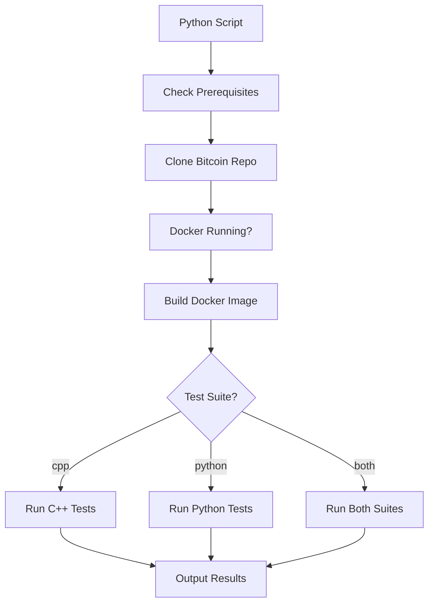

# Bitcoin Core Tests Runner

A one-click Docker-based solution to run Bitcoin Core C++ unit tests and Python functional tests.

## 🚀 Quick Start

### Prerequisites

1. **Python 3.6+** installed
2. **Git** installed
3. **Docker and Docker Compose** installed and running
4. **colorama** (optional, for colored output): `pip install -r requirements.txt`

### One-Click Execution

```bash
# Run all tests (C++ and Python) - cross-platform
python run-bitcoin-tests.py

# Run only C++ unit tests
python run-bitcoin-tests.py --cpp-only

# Run only Python functional tests
python run-bitcoin-tests.py --python-only

# Run quick Python tests
python run-bitcoin-tests.py --python-only --python-tests quick

# or make executable: chmod +x run-bitcoin-tests.py && ./run-bitcoin-tests.py
```

**Note:** The bitcoin/ directory will be created automatically when running the script

## 🛠️ How It Works

### Architecture

1. **Repository Cloning**: Automatically downloads Bitcoin source from GitHub (customizable)
2. **Dockerfile**: Creates Ubuntu 22.04 container with all Bitcoin Core build dependencies
3. **docker-compose.yml**: Orchestrates build and test execution
4. **Python Script**: Cross-platform interface with Git cloning and prerequisite checks
5. **Environment Config**: Allows customization via `.env` file
6. **Test Suite Selection**: Run C++ tests, Python tests, or both

### Build Process



## 📋 Configuration

### Environment Variables (.env)

```bash
# Build type: Debug, Release, RelWithDebInfo, MinSizeRel
BUILD_TYPE=RelWithDebInfo

# Test suite selection: cpp, python, or both
TEST_SUITE=both

# Python test scope: all, standard, quick, or specific test name
PYTHON_TEST_SCOPE=standard

# Number of parallel jobs for Python tests
PYTHON_TEST_JOBS=4

# C++ test arguments (see bitcoin/src/test/README.md)
CPP_TEST_ARGS=

# Python test arguments
PYTHON_TEST_ARGS=

# Exclude specific Python tests (comma-separated)
EXCLUDE_TESTS=

# Verbose output
VERBOSE=0
```

### Python Script Features

The Python script provides:
- **Cross-platform compatibility** (Windows, macOS, Linux)
- **Colored output** for better readability
- **Proper error handling** and cleanup
- **Duration tracking** for performance monitoring
- **Prerequisites checking** before execution
- **Flexible test suite selection** (C++, Python, or both)
- **Configurable Python test scope** (all, standard, quick, or specific tests)

## 🧪 Test Execution Examples

### Run All Tests (Default)
```bash
# Run both C++ and Python tests with default Bitcoin Core repository (master branch)
python run-bitcoin-tests.py

# Run tests with custom repository and branch
python run-bitcoin-tests.py --repo-url https://github.com/myfork/bitcoin --branch my-feature-branch

# Short options
python run-bitcoin-tests.py -r https://github.com/bitcoin/bitcoin -b v25.1
```

### Run Specific Test Suites
```bash
# Run only C++ unit tests
python run-bitcoin-tests.py --cpp-only

# Run only Python functional tests (standard suite)
python run-bitcoin-tests.py --python-only

# Run quick Python tests (fastest subset)
python run-bitcoin-tests.py --python-only --python-tests quick

# Run all Python tests including extended tests
python run-bitcoin-tests.py --python-only --python-tests all

# Run a specific Python test
python run-bitcoin-tests.py --python-only --python-tests wallet_basic

# Run multiple specific tests
python run-bitcoin-tests.py --python-only --python-tests "wallet_basic.py mempool_accept.py"

# Exclude specific tests
python run-bitcoin-tests.py --python-only --exclude-test feature_fee_estimation --exclude-test rpc_blockchain

# Control Python test parallelism
python run-bitcoin-tests.py --python-only --python-jobs 8

# Make executable and run directly (Linux/macOS)
chmod +x run-bitcoin-tests.py && ./run-bitcoin-tests.py
```

### Features
- **Automatic repository cloning** - downloads Bitcoin source code from GitHub
- **Custom repository support** - use your own fork and branch
- **Prerequisites checking** - verifies Git, Docker, and required files
- **Clean build process** - builds Docker image with optimized Bitcoin Core compilation
- **Dual test suite support** - runs C++ unit tests (686+) and Python functional tests (300+)
- **Flexible test selection** - run C++ only, Python only, or both
- **Configurable Python tests** - choose all, standard, quick, or specific tests
- **Parallel test execution** - configurable parallel jobs for faster Python test runs
- **Success/failure reporting** - clear colored output with test results
- **Automatic cleanup** - removes containers and networks after completion
- **Duration tracking** - shows total execution time

## 🔧 Advanced Usage

### Custom Test Arguments

Edit `.env` file for complex test configurations:

**C++ Tests:**
```bash
# Run specific C++ test suite
CPP_TEST_ARGS=--run_test=getarg_tests

# Run with debug logging
CPP_TEST_ARGS=--log_level=all --run_test=getarg_tests

# Run with console output
CPP_TEST_ARGS=--run_test=getarg_tests -- -printtoconsole=1
```

**Python Tests:**
```bash
# Run standard test suite (default)
TEST_SUITE=python
PYTHON_TEST_SCOPE=standard

# Run quick tests only
PYTHON_TEST_SCOPE=quick

# Run all tests including extended
PYTHON_TEST_SCOPE=all

# Run specific test(s)
PYTHON_TEST_SCOPE=wallet_basic.py

# Exclude specific tests
EXCLUDE_TESTS=feature_fee_estimation,rpc_blockchain

# Increase parallel jobs
PYTHON_TEST_JOBS=8
```

### Manual Docker Commands

```bash
# Build image manually
docker-compose build

# Run tests manually
docker-compose run --rm bitcoin-tests

# Debug in container
docker-compose run --rm bitcoin-tests /bin/bash

# View logs
docker-compose logs bitcoin-tests
```

### Performance Optimization

For faster builds on powerful machines:

1. Edit `docker-compose.yml` and add build args:
```yaml
services:
  bitcoin-tests:
    build:
      args:
        CMAKE_BUILD_PARALLEL_LEVEL: 8  # Adjust based on your CPU cores
```

2. Use more parallel jobs in PowerShell script

## 🐛 Troubleshooting

### Common Issues

#### Docker Not Running
```
✗ Docker is not running
```
**Solution**: Start Docker Desktop and wait for it to be ready.

#### Bitcoin Source Missing
```
✗ Bitcoin source directory not found at ./bitcoin
```
**Solution**: Ensure Bitcoin Core source code is cloned into `bitcoin/` directory.

#### Build Failures
```
✗ Failed to build Docker image
```
**Solutions**:
- Run with `-CleanBuild` flag
- Check Docker Desktop has sufficient resources (4GB+ RAM recommended)
- Clear Docker cache: `docker system prune -a`

#### Test Failures
```
✗ Some tests failed (exit code: X)
```
**Solutions**:
- Use `--verbose` flag for detailed output
- Use `--keep-containers` to inspect container
- Check test logs: `docker-compose logs bitcoin-tests`
- For Python tests: check which specific test failed in the output
- Try running the specific failing test alone: `--python-only --python-tests test_name`

#### Python Test Timeouts
```
Python functional tests taking too long
```
**Solutions**:
- Run quick tests only: `--python-tests quick`
- Increase parallel jobs: `--python-jobs 8`
- Run specific tests instead of full suite
- Exclude slow tests: `--exclude-test feature_pruning --exclude-test feature_dbcrash`

## 📚 Reference

### Bitcoin Core Test Documentation

This setup follows the official Bitcoin Core testing documentation:

**C++ Unit Tests** (bitcoin/src/test/README.md):
- **Build Command**: `cmake -B build -DBUILD_TESTS=ON`
- **Compile**: `cmake --build build -j$(nproc)`
- **Run Tests**: `build/bin/test_bitcoin`
- **Test Arguments**: Follow Boost.Test framework conventions

**Python Functional Tests** (bitcoin/test/functional/README.md):
- **Run All**: `test/functional/test_runner.py`
- **Run Specific**: `test/functional/test_runner.py wallet_basic.py`
- **Parallel Execution**: `test/functional/test_runner.py --jobs=8`
- **Extended Tests**: `test/functional/test_runner.py --extended`

### Key Test Commands

**C++ Tests:**
| Command | Description |
|---------|-------------|
| `--list_content` | List all available tests |
| `--run_test=<suite>` | Run specific test suite |
| `--run_test=<suite>/<test>` | Run specific test |
| `--log_level=all` | Verbose logging |

**Python Tests:**
| Command | Description |
|---------|-------------|
| `--jobs=N` | Run N tests in parallel |
| `--extended` | Include extended tests |
| `--exclude test_name` | Exclude specific test |
| `--help` | Show all available options |

## 🤖 AI Model Usage

### Automated Testing Workflow

```bash
# 1. Initial setup and full test run (clones Bitcoin Core master, runs all tests)
python run-bitcoin-tests.py

# 2. Quick validation (C++ tests only)
python run-bitcoin-tests.py --cpp-only

# 3. Quick Python test validation
python run-bitcoin-tests.py --python-only --python-tests quick

# 4. Test with specific branch or fork
python run-bitcoin-tests.py --repo-url https://github.com/bitcoin/bitcoin --branch v25.1

# 5. Test your own fork and feature branch
python run-bitcoin-tests.py --repo-url https://github.com/myfork/bitcoin --branch my-feature-branch

# 6. CI/CD integration - full test suite
python run-bitcoin-tests.py -r https://github.com/bitcoin/bitcoin -b master
```

### CI/CD Integration

This setup is designed for automated testing environments:

- **Idempotent**: Safe to run multiple times
- **Isolated**: No host system pollution
- **Configurable**: Environment-based customization
- **Observable**: Clear success/failure reporting

### Error Pattern Recognition

When tests fail, look for:

1. **Build Errors**: Check Dockerfile dependencies
2. **Test Failures**: Review test output for specific assertions
3. **Environment Issues**: Verify Docker and host system state
4. **Configuration Problems**: Check `.env` file settings

## 📄 License

This setup is provided as-is for testing Bitcoin Core. The Bitcoin Core source code is licensed under the MIT License.